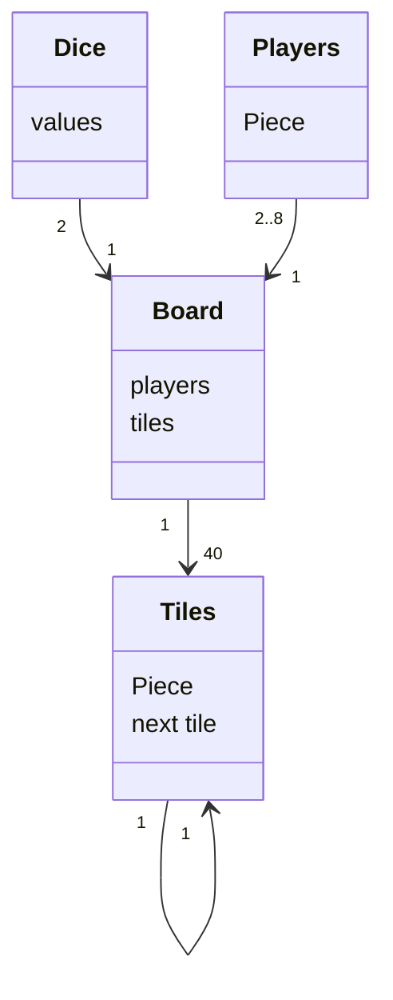

```mermaid
classDiagram
	Dice "2" --> "1" Board
	Players "2..8" -- > "1" Board
	Board "1" --> "40" Tiles
	Tiles "1" --> "1" Tiles
	class Players{
		Piece
	}
	class Tiles{
		Piece
		next tile
	}
	class Dice{
		values
	}
	class Board{
		players
		tiles
	}
```
